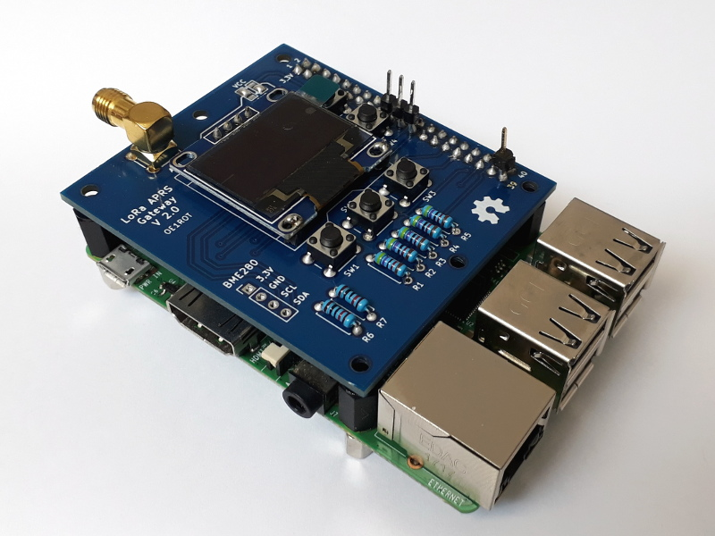

# Raspberry Pi LoRa KISS TNC

This project emulates a KISS TNC and controls a hardware LoRa transceiver
connected to the Raspberry´s SPI. That makes it possible to use existing
software, like digipeaters, with LoRa radio communication. The KISS TNC is
accessed via its TCP server.

The current application is to run the KISS TNC together with the APRS digi [APRX](https://github.com/PhirePhly/aprx), which connects via TCP and provides
powerful APRS digipeating and I-gate functionality for LoRa-APRS.

## Hardware

The LoRa KISS TNC runs on Raspberry Pi 2 or newer together with the
*LoRa APRS Gateway Hat V2.0*. However, any 433MHz RFM95 LoRa module can be
wired up to the Raspberry Pi.

## Development

This program and documentation is in a very early state and very experimental.
Only the LoRa radio modem of the gateway board is supported at the moment.
Display and buttons are not working.

### To Do
* Python 3 compatibility
* Get display and buttons working
* Noise floor telemetry
* Installation guide and documentation
* Proper configuration file
* ...
